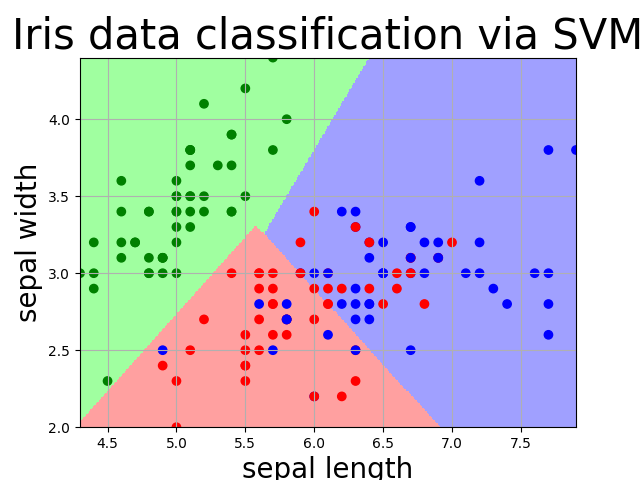

# 北京理工大学 机器学习基础 课程设计
> 一门水课，共要求完成两个项目
## 1 decisionTree
使用ID3算法构造决策树，给定的数据集的决策变量取值都是二分的，且分类结果也只有两类。
所以我手写了一个简单的多决策变量离散二值域的二分类决策树，当然也可以调包
### 1.1 核心问题
1. 计算信息增益 \
    InfoGain(label) = entropy(dataSet) - InfoLabel(dataSet,label)\
    其中InfoLabel是数据集相对于某一标签的不同取值的信息熵\
    infoLabel(dataSet,label) = sigma[ W_{label=i} * entropy(sub_dataSet_{label=i}) ] \
    entropy(dataSet) 为相对于分类种类的香农信息熵
2. 递归建树
3. 递归的中止条件
   1. 当前dataSet中分类结果（y值）全相同
   2. 当前dataSet为空
   3. max info gain == 0 ， 即dataSet对任意属性不可分
   4. 层数达到人为指定的最大深度max_depth

### 1.2 可改进方面
1. 将算法支持的决策变量值域从离散的二值扩充到离散的多值，再扩充到连续值域
2. 在1基础上包装成类，以便复用

## 2 使用svm对iris数据集分类

调sklearn包就写完了;)\
>一个小trick：鸢尾花数据集只有前两维线性可分，采用线性核svm训练后，可以使用训练好的模型将二维平面染色。
x轴和y轴分别对应前两维，绘图范围是xy的可能值域，将平面分成大约500*500=250000个细小格点，
对每个（x，y）格点预测一个结果，不同结果染成不同颜色，再将testSet中的点按照实际分类染色后置于预测图中，
就能够清晰的看到模型预测和真实值的差异。效果如下图：

