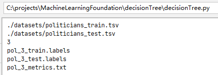

# 决策树实验报告

> 07111905 许哲源 1120192079

## 1. inspection.py的设计与实现

inspection.py要求计算根节点的熵，故只需要统计样本的各个决策的个数。由于给定的数据集中只有正负两种标签，只需取数量较多的作为决策结果，即不管输入是什么，均预测为大多数情况下做出的决策。

据此，根据定义得到

```python
p = positive_num / total_num
p = p if p >= 0.5 else 1 - p    # 取两者中数量大的作为标签
entropy = -p * log2(p) - (1 - p) * log2(1 - p)
error = 1 - p
```

为entropy 以及 error 的计算方式。

## 2. decisionTree.py的设计与实现

### 2.0 总体设计思路

采用**IR3**的决策树算法，算法的核心问题有三个：

1. **采用递归的方式建树**

   ```python
   def buildDecisionTree(dataSet, labels, depth=0) -> TreeNode:
   ```

   其中 dataSet和label的对应列是匹配的，具体的数据表示格式见2.1.2节递归过程中的数据集及标签

2. **信息增益的计算**

   `Info Gain = entropy(dataSet) - infoLabel(dataSet, label)`

   ​		其中信息熵entropy , 是根据dataSet中的分类结果的分布情况计算的，设第i类分布结果占全部分类结果的比例为 pi ，则

    $ entropy = - \Sigma_{i\in dataSet} p_i log_2{p_i} $

   在本次作业中，由于分类结果只有两种，退化为如下函数:

   ```python
   def entropy(dataSet) -> float:
       p = 0
       for data in dataSet:
           if data[-1] == positive_class:
               p += 1
       p /= len(dataSet)
       return -p * log2(p) - (1 - p) * log2(1 - p) if p != 0 and p != 1 else 0
   ```

   ​		

   ​		而对于某一决策属性的熵，则是根据属性的不同取值，将样本划分为多个子样本，再统计这些子样本的加权平均熵，即

   $ infoLabel(D)=∑_{j=1}^{v}\frac{|Dj|}{|D|}entropy(Dj) $

   在本次作业中，由于属性只有两种取值，退化为如下函数:

   ```python
   def infoLabel(dataSet, labelIndex) -> float:
       dataSet_pos_label = [data for data in dataSet if data[labelIndex] == positive_label]
       dataSet_neg_label = [data for data in dataSet if data[labelIndex] == negative_label]
       Dp_size = len(dataSet_pos_label)
       Dn_size = len(dataSet_neg_label)
       D_size = len(dataSet)
       return Dp_size / D_size * entropy(dataSet_pos_label) + Dn_size / D_size * entropy(dataSet_neg_label)
   ```

   

3. **递归的中止条件**

   1. 当前dataSet的class列全部相同，即数据集的y值相同，直接返回以当前y值为决策的叶子结点

   2. 当前dataSet为空，返回一个叶子节点，其中决策为初始的样本集的major决策

   3. 递归深度达到规定的最大层数，返回一个叶子节点，其中决策为当前dataSet的major决策

   4. 当前dataSet的每个label的信息增益都是0，此时样本的决策label对做出决策没有任何帮助，例子如下：

      | label | result |
      | ----- | ------ |
      | sunny | out    |
      | windy | out    |
      | sunny | in     |
      | windy | in     |

      可以看到天气好坏对外出的决策没有任何影响，此时信息增益为0

### 2.1 训练过程的中间数据表示

#### 2.1.1 决策树的结点表示

```python
class TreeNode:
    # leave choice 只有当是叶子节点的时候有效; attr只有当非叶子节点时有效，此时左右子树必然存在
    def __init__(self, label=None, left_node=None, right_node=None, leaf_choice=None):
        # 非叶子节点的有效字段
        self.label: str = label
        self.left_child: TreeNode = left_node
        self.right_child: TreeNode = right_node
        # 叶子节点的有效字段
        self.leaf_choice: str = leaf_choice
```

若是分叉节点，则label域，左右子树域有效。label保存了当前选择的决策变量，若为规定的正值则进入左子树节点，若为规定的负值则进入右子树节点

若是叶子节点，则leaf_choice域有效，保存了最终做出的决策

#### 2.1.2 递归过程中的数据集及标签：

对于函数`buildDecisionTree(dataSet, labels, depth=0) -> TreeNode:`

其中的labels以及dataSet是相匹配的，形式如下：

* dataSet

  样本的labels以及class组合成的二维矩阵 。

   每一行形如 [ x1, x2 , ... , xn, y ]，x是labels（决策变量）的值，y是class(分类)的值

  例如['n' , 'y' , 'n' , 'democrat ']

* labels

  决策变量的名称列表。

  形如[name_of_x1, name_of_x2 , ... , name_of_xn ]
  
  例如['Anti_satellite_test_ban' , 'Export_south_africa' , 'Superfund_right_to_sue']

dateSet 和 label ， 在递归建树的过程中总是匹配的。


### 2.2 程序流程及部分源码

1. **从环境接受输入参数，并进行简单的判错**

   ```python
       if len(sys.argv) != 7:
           print("unmatched argument numbers")
           exit(0)
   
       train_input = sys.argv[1]
       test_input = sys.argv[2]
       max_depth = int(sys.argv[3])
       train_output = sys.argv[4]
       test_output = sys.argv[5]
       metrics_output = sys.argv[6]
   
       # 处理外围的输入错误
       if not os.path.exists(train_input) or not os.path.exists(test_input):
           print("input file does not exist!")
           exit(0)
       if max_depth < 0:
           print("max_depth must be positive!")
           exit(0)
   ```

   

2. **加载数据和标签**

   ```python
   train_dataSet, train_labels = loadTsv(train_input)
   test_dataSet, test_labels = loadTsv(test_input)
   ```

   加载函数为：

   ```python
   # 从tsv文件中加载数据集以及标签名称
   def loadTsv(input_file):
       """
       返回值一览：
       labels:用于决策的变量的名称列表,形如[name_of_x1,name_of_x2,...,name_of_xn]
       dataSet:样本的labels以及class组合成的二维矩阵 ， 每一行形如 [x1,x2,...,xn,y]，x是labels（决策变量）的值，y是class(分类)的值
       """
       tsv = []
       with open(input_file, 'r') as fp:
           tsvReader = csv.reader(fp, delimiter='\t')
           for line in tsvReader:
               tsv.append(line)
       labels = tsv[0][:-1]
       dataSet = tsv[1:]
       return dataSet, labels
   ```

   返回的数据集以及标签格式和2.1.2节的中间表示的定义保持一致

3. **初始化全局变量的值**

   全局变量如下

   ```python
   max_depth = 0  # 最大深度
   positive_class = ''  # 正分类名称
   negative_class = ''  # 负分类名称
   positive_label = ''  # 标签的正值
   negative_label = ''  # 标签的负值
   train_major_class_value = ''  # 训练集中的主要分类
   ```

   其中，正分类为字典序较为靠后的那一个，在叶子节点平票的时候，优先选择正分类作为模型输出的结果

4. **依据训练集建立决策树**

   ```
   train_treeRoot = buildDecisionTree(train_dataSet, train_labels)
   ```

   （1）核心建树函数：根据2.0节中的4个递归中止条件，分别生成并返回叶子节点

   ```python
   def buildDecisionTree(dataSet, labels, depth=0) -> TreeNode:
       # 结束条件（叶子节点标志）
       classValues = [data[-1] for data in dataSet]
       if classValues.count(classValues[0]) == len(classValues):  # class列全相同
           return TreeNode(leaf_choice=classValues[0])
       if len(dataSet) == 0:  # 没有样本
           leaf_choice = train_major_class_value
           return TreeNode(leaf_choice=leaf_choice)
       if depth == max_depth:  # 到达最大深度
           leaf_choice = getMajorClassValue(dataSet)
           return TreeNode(leaf_choice=leaf_choice)
   
       # 找到用于决策的label以及其在data中的列序号
       chosen_label = ''
       max_IG = 0
       info = entropy(dataSet)
       for index, label in enumerate(labels):
           IG = info - infoLabel(dataSet, index)
           if IG > max_IG:     # 严格大于才更新记录，以确保平票的时候，找到的是第一个出现的标签
               max_IG = IG
               chosen_label = label
   
       # 最大信息增益为0时，直接返回叶节点，此时有
       # 有infoLabel == entropy(dataSet) != 0
       # 可能的例子如下：
       # label | class
       # sunny | out
       # windy | out
       # sunny | in
       # windy | in
       if max_IG == 0:
           leaf_choice = getMajorClassValue(dataSet)
           return TreeNode(leaf_choice=leaf_choice)
   
       chosen_label_index = labels.index(chosen_label)  # 在删除前保存一下原始的选中的列序号，以供分割函数使用
       labels.remove(chosen_label)  # 删除选定的标签列
   
       left_dataSet = splitDataSet(dataSet, chosen_label_index, positive_label)  # 根据选定标签的正值划分数据集
       left_labels = labels[:]  # 注意python对于列表传的是引用，需要复制一份再递归
       pos_n, neg_n = countClass(left_dataSet)  # 为打印做准备
       print("| " * (depth + 1), end='')
       print("{label} = {label_value}: [{pos_n} {pos_class}/{neg_n} {neg_class}]".format(
           label=chosen_label,
           label_value=positive_label,
           pos_n=pos_n,
           pos_class=positive_class,
           neg_n=neg_n,
           neg_class=negative_class
       ))
       left_node = buildDecisionTree(left_dataSet, left_labels, depth + 1)
   
       right_dataSet = splitDataSet(dataSet, chosen_label_index, negative_label)  # 根据选定标签的负值划分数据集
       right_labels = labels[:]  # 注意python对于列表传的是引用，需要复制一份再递归
       pos_n, neg_n = countClass(right_dataSet)  # 为打印做准备
       print("| " * (depth + 1), end='')
       print("{label} = {label_value}: [{pos_n} {pos_class}/{neg_n} {neg_class}]".format(
           label=chosen_label,
           label_value=negative_label,
           pos_n=pos_n,
           pos_class=positive_class,
           neg_n=neg_n,
           neg_class=negative_class
       ))
       right_node = buildDecisionTree(right_dataSet, right_labels, depth + 1)
   
       return TreeNode(label=chosen_label, left_node=left_node, right_node=right_node)
   ```

   （2）对数据集的分割是通过 `def splitDataSet(dataSet, axis, value) -> []`来完成的。将dataSet中序号为axis 的列中 ， 取值为value的所有行拿出来，删除axis这一列之后，成为分割完成的数据集。函数如下：

   ```python
   # 根据某一列的取值，将符合条件的若干行取出，并删去用于筛选的列
   def splitDataSet(dataSet, axis, value) -> []:
       ret_dataSet = []
       for data in dataSet:
           if data[axis] == value:
               new_data = data[:axis]
               new_data.extend(data[axis + 1:])
               ret_dataSet.append(new_data)
       return ret_dataSet
   ```

   （3）树的可视化打印在建树的过程中同步进行。打印左子树需要

   1. 当前选出的列的名称
   2. 这个列的正取值名字
   3. 分割出的子集中的正负分类的结果个数的统计
   4. 树的深度信息，以打印若干 ' | '

   打印右子树则需要对称的内容。因此，将统计数据集中正负分类各自个数的功能封装为一个函数，函数如下：

   ```python
   # 获取数据集中的正负分类的各自的数量
   def countClass(dataSet) -> (int, int):
       pos, neg = 0, 0
       for data in dataSet:
           if data[-1] == positive_class:
               pos += 1
           else:
               neg += 1
       return pos, neg
   ```

   根据这些内容，就能够进行树的递归打印.

5. 根据训练好的模型，在训练集和测试集上进行预测，计算两个误差率保存在指定的误差输出文件中，并分别保存预测结果到训练集和测试集对应的预测输出文件中。

   ```python
   def calcErrorAndSave(treeRoot: TreeNode, dataSet, output_file: str, labels: [str]) -> float:
       error = 0
       with open(output_file, 'w') as fp:
           for data in dataSet:
               # 使用完整的test_labels和训练好的决策树对训练集预测
               result = predict(labels, treeRoot, data[:-1])
               fp.write(result + '\n')
               if result != data[-1]:
                   error += 1
       error /= len(dataSet)
       return error
   ```

   其中预测函数 predict 根据当前树节点对应的决策变量的取值，来决定进入左子树或者右子树，采用了递归的方式得到结果。

   ```python
   # 对一组决策变量x根据决策树以及标签进行预测
   def predict(labels: [str], treeNode: TreeNode, x: [str]) -> str:
       if not treeNode.left_child:   # 当前已经是叶子节点，直接返回结果
           return treeNode.leaf_choice
       index = labels.index(treeNode.label)
       if x[index] == positive_label:
           return predict(labels, treeNode.left_child, x)
       else:
           return predict(labels, treeNode.right_child, x)
   ```

## 3. 实验结果与分析

### 3.1 inspection.py

(1) bash中检测small数据集

```bash
python3 inspection.py small_train.tsv small_inspect.txt
```

得到`small_inspect.txt`：

> ```
> entropy: 0.996316519558962
> error: 0.4642857142857143
> ```


(2) bash中检测education数据集

```bash
python3 inspection.py education_train.tsv edu_inspect.txt
```

得到 `edu_inspect.txt`

> ```
> entropy: 0.9097361225311661
> error: 0.32499999999999996
> ```


(3) bash中检测mushroom数据集

```bash
python3 inspection.py mushroom_train.tsv mushroom_inspect.txt
```

得到`mushroom_inspect.txt`

>```
>entropy: 0.9626147059982517
>error: 0.3866666666666667
>```


(4) bash中检测politicians数据集

```bash
python3 inspection.py politicians_train.tsv politicians_inspect.txt
```

得到`politicians_inspect.txt`

>```
>entropy: 0.9905894286537543
>error: 0.4429530201342282
>```


简单分析：

由于按照大多数进行所有的决策，在训练集和测试集随机分割的前提下，错误率应该在0.5以下，四个测试结果均满足这一规律。 


### 3.2 decisionTree.py

1. 在small数据集上运行测试，参数指定如下

   

   得到结果如下：

   

   .txt文件内容为

   ```
   error(train): 0.07142857142857142
   error(test): 0.14285714285714285
   ```

   bash的打印结果为：

   ```
   [13 republican/15 democrat]
   | Anti_satellite_test_ban = y: [1 republican/13 democrat]
   | | Export_south_africa = y: [0 republican/13 democrat]
   | | Export_south_africa = n: [1 republican/0 democrat]
   | Anti_satellite_test_ban = n: [12 republican/2 democrat]
   | | Export_south_africa = y: [7 republican/2 democrat]
   | | Export_south_africa = n: [5 republican/0 democrat]
   ```

   这与homework中给定的示例树是同构的。由于打印时属性的先后顺序在homework中没有规定，且不管是按照字典序或者逆字典树依次打印属性时，都没有办法让所有数据集的打印表现一致，故这里采用属性字段在整个数据集中出现的先后顺序作为打印的依据。

   交换训练集与测试集，树的打印结果如下：

   ```
   [15 republican/13 democrat]
   | Anti_satellite_test_ban = y: [0 republican/9 democrat]
   | Anti_satellite_test_ban = n: [15 republican/4 democrat]
   | | Export_south_africa = y: [10 republican/4 democrat]
   | | Export_south_africa = n: [5 republican/0 democrat]
   ```

   这与homework中给定的结果是一致的。

2. 在三个数据集上的测试结果

   1. **politicians数据集**

      

      给出的两个预测误差分别为：

      ```
      error(train): 0.11409395973154363
      error(test): 0.1686746987951807
      ```

      bash的打印结果为：

      ```
      [66 republican/83 democrat]
      | Superfund_right_to_sue = y: [64 republican/28 democrat]
      | | Aid_to_nicaraguan_contras = y: [6 republican/15 democrat]
      | | | Mx_missile = y: [6 republican/3 democrat]
      | | | Mx_missile = n: [0 republican/12 democrat]
      | | Aid_to_nicaraguan_contras = n: [58 republican/13 democrat]
      | | | Export_south_africa = y: [38 republican/13 democrat]
      | | | Export_south_africa = n: [20 republican/0 democrat]
      | Superfund_right_to_sue = n: [2 republican/55 democrat]
      | | Export_south_africa = y: [1 republican/55 democrat]
      | | | Immigration = y: [1 republican/9 democrat]
      | | | Immigration = n: [0 republican/46 democrat]
      | | Export_south_africa = n: [1 republican/0 democrat]
      ```

      

   2. **education数据集**

      

      给出的两个误差分别为：

      ```
      error(train): 0.17
      error(test): 0.205
      ```

      bash的打印结果为：

      ```
      [65 notA/135 A]
      | F = notA: [42 notA/16 A]
      | | M2 = notA: [27 notA/3 A]
      | | | M4 = notA: [22 notA/0 A]
      | | | M4 = A: [5 notA/3 A]
      | | M2 = A: [15 notA/13 A]
      | | | M4 = notA: [14 notA/7 A]
      | | | M4 = A: [1 notA/6 A]
      | F = A: [23 notA/119 A]
      | | M4 = notA: [21 notA/63 A]
      | | | M2 = notA: [18 notA/26 A]
      | | | M2 = A: [3 notA/37 A]
      | | M4 = A: [2 notA/56 A]
      | | | P1 = notA: [2 notA/15 A]
      | | | P1 = A: [0 notA/41 A]
      ```

      

   3. **mushrooms数据集**

      

      给出的两个误差分别为：

      ```
      error(train): 0.02266666666666667
      error(test): 0.02071563088512241
      ```

      bash的打印结果为：

      ```
      [2320 1/3680 0]
      | odor_foul = 1: [1632 1/0 0]
      | odor_foul = 0: [688 1/3680 0]
      | | gill-size_broad = 1: [72 1/3392 0]
      | | | spore-print-color_green = 1: [72 1/0 0]
      | | | spore-print-color_green = 0: [0 1/3392 0]
      | | gill-size_broad = 0: [616 1/288 0]
      | | | odor_none = 1: [40 1/192 0]
      | | | odor_none = 0: [576 1/96 0]
      ```


## 4. 实验总结与改进

​		本次实验使用ID3算法手写了一颗简单的决策树。decisionTree.py还可以再加改进，使其能够支持 1.分类结果取值大于2  2.决策变量取值为多个离散值/连续值 。 算法也可以从ID3升级为C4.5等等 ， 可以添加更多决策函数的支持，而不仅仅是信息增益，例如可以添加信息增益比率，GINI指标等等的支持。

​		实验的过程中，一开始没有考虑到infolabel调用entropy()时 dataSet可能为空的问题，导致了一个除零错误。在计算交叉熵的时候，直接计算 plogp 也忘记考虑 p=0 时不在log函数的定义域内的问题，这提示我编程时需要特别考虑边界情况和极端情况。


