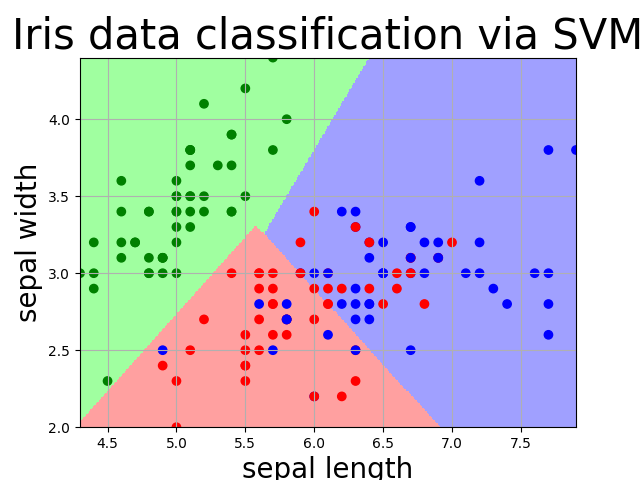
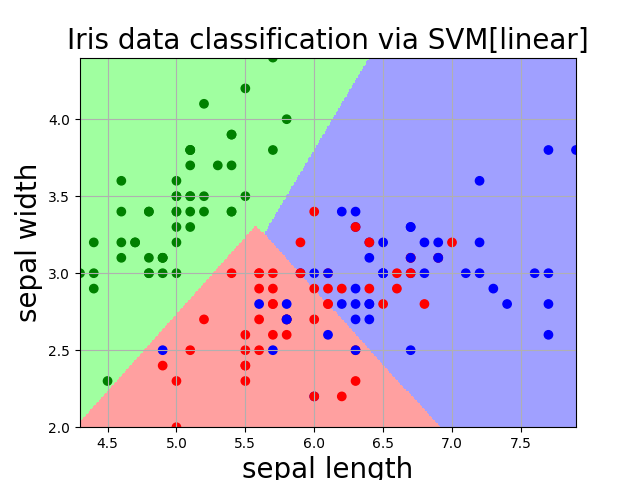
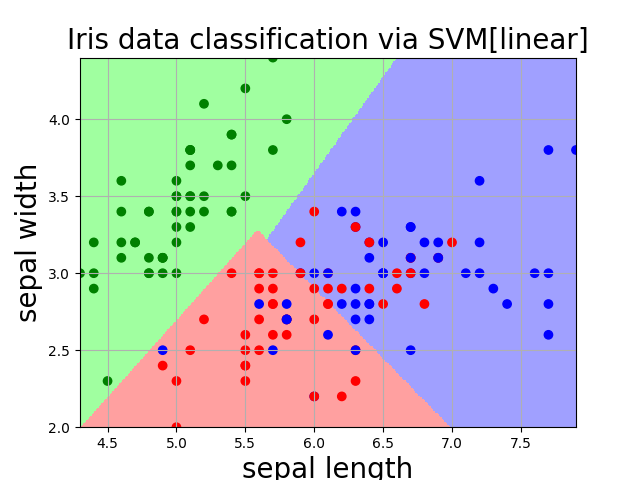
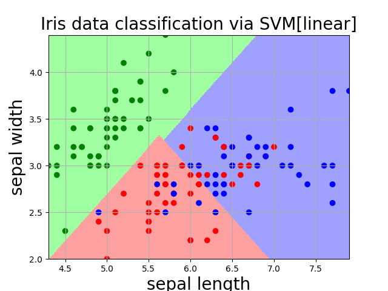
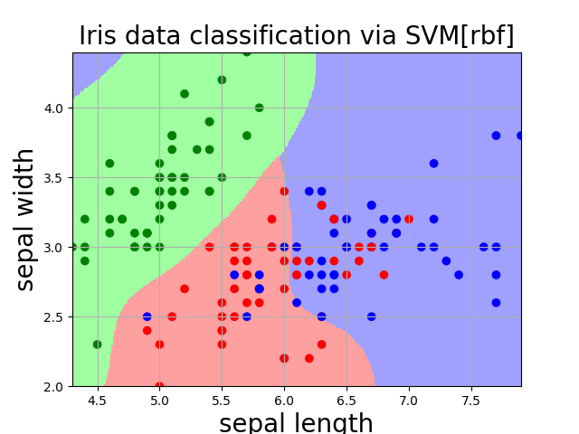
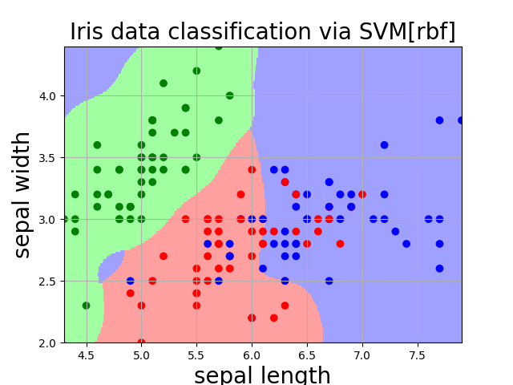
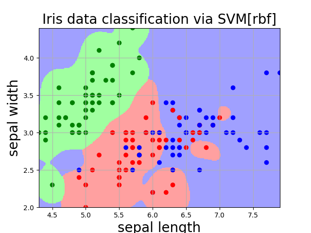
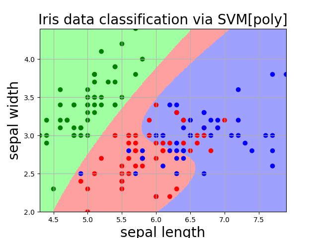

# svm实验报告
> 许哲源 07111905 1120192079

## 1 实验目的及要求
采用svm方法对鸢尾花数据集进行分类。其中训练集和测试集按80%-20%划分。

选用的方法具体SVM方法不限。提交源码和实验报告。

本次数据集很经典，实验本身是基于SVM支持向量机技术对数据集Iris进行特征分类。实验采取Sklearn函数库来实现SVM，并使用SVM对提取好的特征进行分类，结果的展示方面进行了数据可视化保证观测结果清晰可见。

首先，Iris数据集的中文名是安德森鸢尾花卉数据集，Iris包含150个样本，对应数据集的每行数据。每行数据包含每个样本的四个特征和样本的类别信息，所以iris数据集是一个150行5列的二维表形式的样本，被应用于多类模型的实验当中。
还需要进一步介绍数据集的内容：数据集当中，每个样本包含了花萼长度、花萼宽度、花瓣长度、花瓣宽度四个特征（前4列），我们需要建立一个分类器，分类器可以通过样本的四个特征来判断样本属于山鸢尾、变色鸢尾还是维吉尼亚鸢尾（‘Iris-setosa’, ‘Iris-versicolor’ , ‘Iris-virginica’）。当然数据集默认为str分类的，位于第五列，而由于在在分类中类别标签必须为数字量，所以应将Iris.data中的第5列的类别（字符串）转换为数字形式。这是需要进行人工清洗的一个过程。

## 2 实验过程
### 2.0 数据集的处理

采用numpy读取数据集的前两维，并将最后一维的分类文本信息转化为数字

```python
def iris_type(name):
    map = {
        b'Iris-setosa': 0,
        b'Iris-versicolor': 1,
        b'Iris-virginica': 2
    }
    return map[name]

data = np.loadtxt(
        fname=filename,
        dtype=float,  # 数据类型
        delimiter=',',  # 分隔符
        converters={4: iris_type}  # 将第5列文字分类替换为数字
    )
```


### 2.1 使用的实验方法

采用了sk-learning中的svm包来构造软间隔核化SVM完成相应的预测任务。

完成了以下工作：

1. 软间隔线性svm，决策函数类型为 one versus rest ， 误差惩罚系数C取不同值的对比实验

   > 当decision_function_shape='ovr’时，为one v rest（一对多），即一个类别与其他类别进行划分，而当decision_function_shape='ovo’时，为one v one（一对一），即将类别两两之间进行划分，用二分类的方法模拟多分类的结果。

2. 软间隔高斯核svm，gamma取不同值的对比实验

3. 软间隔核化svm，线性核，高斯核，多项式核的对比实验

### 2.2 评价指标

1. 计算在测试集和训练集上的accuracy (::=tp/(tp+tn+fp+fn))

2. 图形化展示模型的预测结果

   ​		鸢尾花数据集只有前两维线性可分，采用线性核svm训练后，可以使用训练好的模型将二维平面染色。x轴和y轴分别对应前两维，绘图范围是xy的可能值域，将平面分成大约500*500=250000个细小格点，对每个（x，y）格点预测一个结果，不同结果染成不同颜色，再将testSet中的点按照实际分类染色后置于预测图中，就能够清晰的看到模型预测和真实值的差异。效果如下图：



浅色的红蓝绿底部染色：表示模型对任意点坐标（sepal length，sepal width）预测的分类结果。

深色的红蓝绿圆点：每个点坐标来自测试集中的（sepal length，sepal width ），染色则来自测试集的分类标签。

### 2.3 线性svm

#### 实验1：C = 0.8 

```python
kernel = 'linear'
def svm_classifier():
    return svm.SVC(
        kernel=kernel,  # 设定为线性核,备选项：linear,rbf,poly
        decision_function_shape='ovr',  # 决策函数
        C=0.8,  # 误差惩罚系数
        gamma=10
    )
```



> train set prediction:0.80833
> test set prediction:0.76667


#### 实验2  C = 2



> train set prediction:0.81667
> test set prediction:0.83333


#### 实验3 C = 5



> train set prediction:0.81667
> test set prediction:0.83333


#### Conclusion 1

在一定范围内，C越大在测试集和训练集上的预测准确率越高，但是当C过大的时候，有可能出现过拟合现象，这里仅选取了三个具有代表性的取值0.8，2，5

#### Conclusion 2

对于iris数据集，从图中可以直观的看到，前两维作为分类标准时，三类标签有一类与其他两个种类是线性可分离的， 模型预测结果与iris数据集本身的特点相符合。


### 2.4 软间隔高斯核svm

#### 实验1 gamma=5



> train set prediction:0.80833
> test set prediction:0.83333

#### 实验2 gamma=10



> train set prediction:0.83333
> test set prediction:0.80000

#### 实验3 gamma=20



#### Conclusion 3 

报告中仅列出了典型取值的模型结果。

gamma取5的时候测试集表现出了很好的预测效果，但是竟然超过了训练集得分，我们认为这是不可靠的，事实上很好理解，gamma过低会导致径向基核欠拟合（当然过高也会过拟合），所以结果不可靠，不能认为是得到了很好的预测结果和模型参数。当gamma达到10-20的时候，测试集得分趋于稳定，我们认为在这个区间上的gamma值才是相对可靠的。

#### Conclusion 4 

当kernel=‘rbf’，为高斯核，gamma值越小，分类界面越连续；gamma值越大，分类界面越“散”，分类效果越好，但有可能会过拟合。

### 2.5 软间隔多项式核svm



> train set prediction:0.79167
> test set prediction:0.80000

## 3 实验心得

参数对比实验由于完成报告的时间仓促，没有将所有的参数值的模型结果全部列出，仅选取典型参数，对已有的关于svm的各种结论做验证性的工作，而非发现规律的实验。故而，实验给出的Conclusion实际上是验证的对象，而非通过简单几个参数就能够得出的结论。